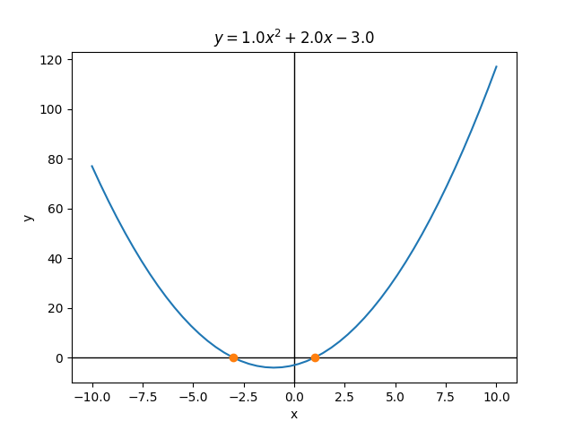

.. _start:

Getting Started
===============
This will walk you through getting started with ``sandbox``.

.. _install:

Installation
------------
To install sandbox, clone the repository from GitHub with::

    git clone https://github.com/soleyhyman/TIMESTEP-SE-sandbox.git

.. _quickstart:

Quickstart with ``sandbox``
---------------------------
To get started using ``sandbox``, you can import the primary class, ``core.quadratic`` and create a quadratic object as, e.g.:
    
>>> from core import quadratic
>>> quad = quadratic(1.,2.,3.)    

To calculate the slope, run:

>>> quad(1.)
6.0

To calculate the roots (or x-intercepts), run:

>>> quad.roots()
((-1+1.4142135623730951j), (-1-1.4142135623730951j))

Notice that both roots are imaginary. 

To calculate the y-intercept, run:

>>> quad.yIntercept()
3.0

To plot the quadratic equation, we need to supply an array of x-value and then can use ``quadratic.plot``:

>>> import numpy as np
>>> x = np.array(-10.,10.)
>>> quad.plot(x)

In this case, the roots are imaginary, so they're not plotted here, but if we specify an equation with real roots, we'll see them plotted on the graph:

>>> import numpy as np
>>> from core import quadratic
>>> x = np.linspace(-10.,10.)
>>> quad = quadratic(1.,2.,-3.)
>>> quad.plot(x)

This gives the following output (image embeded with the rst format):

You can find some examples of how to adjust parameters for that `here <https://pandemic-overview.readthedocs.io/en/latest/myGuides/reStructuredText-Images-and-Figures-Examples.html>`__.

Note that you can also embed an images, links, or other things with html (or any other html embedding) formatting by using ``.. raw:: html``, which you may occasionally want to have more control over formatting, whether links open in new windows, etc. An example of an HTML-embeded image:

.. raw:: html

   

Here is also an example of the |rst-img-html| as above, except that it opens in a new tab.

.. |rst-img-html| raw:: html

   <a href="https://pandemic-overview.readthedocs.io/en/latest/myGuides/reStructuredText-Images-and-Figures-Examples.html" target="_blank">same link</a>